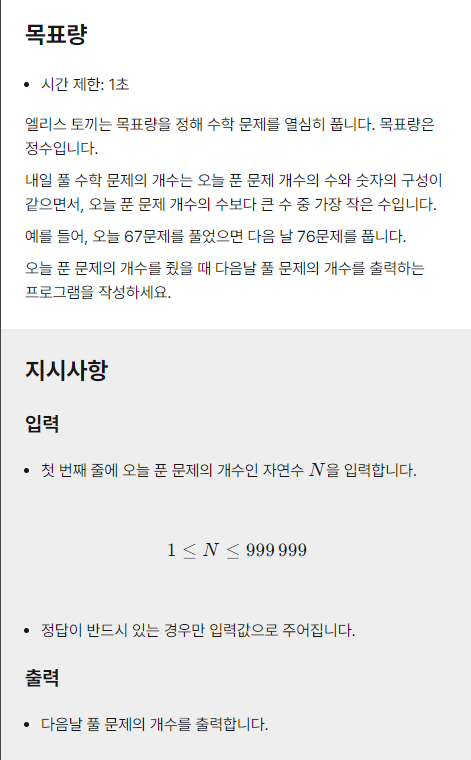

# 요구사항
주어진 수를 구성하는 각 숫자의 자릿수를 바꾼 permutation 집합 중, 주어진 수 보다 딱 한 단계 더 높은 수 찾기

# 제한 사항
시간 제한 1초, N은 1에서 999,999 사이의 자연수

# 접근법
자릿수가 최대 6이므로 수학대신 스트링 탐색으로 접근해도 충분 하다 판단.
수를 Array에 담아 순회하며 조건을 만족하는 수를 찾아 담았으므로, 
출력 조건에 맞추어 다시 배열에서 꺼냄


# 코드
```python
num = [int(x) for x in input()]
N= len(num)

flag = False

for ridx in range(N-1,0,-1):
    for lidx in range(ridx-1,-1,-1):
        if num[lidx] < num[ridx]:
            num[lidx], num[ridx] = num[ridx], num[lidx]
            num = num[:lidx+1] + sorted(num[lidx+1:])
            flag = True
            break
    if flag:
        break

ans = sum([num[x]*10**(N-1-x) for x in range(N)])
print(ans)
```

# 결과
```
/* 코드가 실행되는 중입니다... 
채점을 시작합니다...
================================
Case 1. 테스트를 통과했습니다! (+20)
Case 2. 테스트를 통과했습니다! (+20)
Case 3. 테스트를 통과했습니다! (+20)
Case 4. 테스트를 통과했습니다! (+20)
Case 5. 테스트를 통과했습니다! (+20)
================================
채점을 마쳤습니다.
총 점수: 100 / 100

/* 코드 실행이 완료되었습니다! */
```